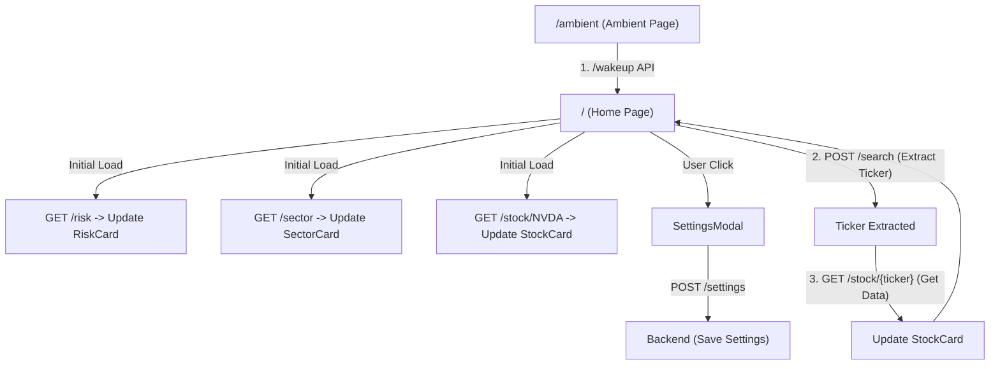

# Architecture

This document describes the application's routing flow and visual component structure.

## 1. Route Flow

### 1) Ambient to Home
- **Entry**: `/ambient`
- **Trigger**: 음성 입력 및 `/wakeup` API 호출.
- **Action**: 홈 페이지(`/`)로 이동하며 초기 데이터를 로드합니다.

### 2) Initial Home Data Load
홈 페이지 진입 시 다음 API들을 비동기적으로 호출하여 대시보드를 구성합니다.
- **RiskCard**: `GET /risk` 호출을 통해 현재 시장 리스크 상태 업데이트.
- **SectorCard**: `GET /sector` 호출을 통해 섹터별 퍼포먼스 데이터 업데이트.
- **StockCard**: `GET /stock/NVDA` (기본값) 호출을 통해 초기 종목 정보 표시.

### 3) Stock Data Update (Voice Search)
- **Step 1 (Extraction)**: `POST /search`를 호출하여 사용자 입력에서 `ticker`를 추출합니다.
- **Step 2 (Data Retrieval)**: 추출된 `ticker`를 사용하여 `GET /stock/{ticker}`를 호출하고, 반환된 데이터로 **StockCard**를 업데이트합니다.

---

## 2. User Settings Flow

사용자의 투자 성향 및 선호 정보를 관리하여 모든 분석 결과에 반영합니다.

### 1) Settings Management
- **Read**: `GET /settings` 호출을 통해 현재 저장된 설정을 가져와 **SettingsModal**에 표시합니다.
- **Save**: 사용자가 설정을 변경하고 저장 시 `POST /settings`를 호출하여 서버에 반영합니다.

### 2) Personalized Analysis (Future)
- 서버는 저장된 `risk_tolerance` 등에 따라 `/risk` 점수 계산 시 가중치를 조절하거나, `/stock` 분석 결과(Gemini)의 톤앤매너를 결정합니다.
