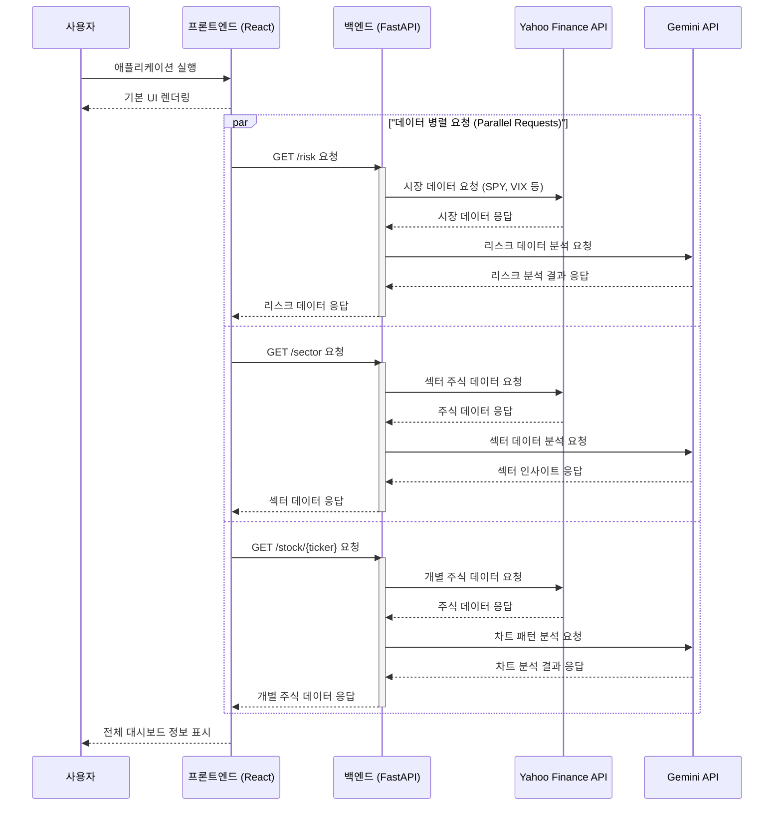
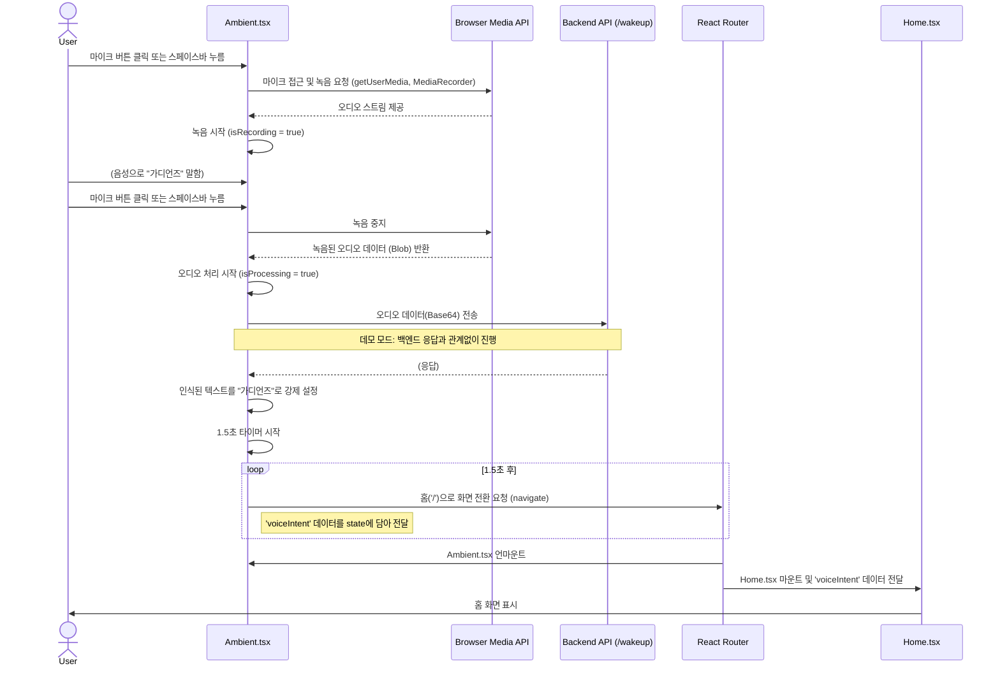

# Guardian Project - Call Sequence Diagram

### 다이어그램 설명

1.  **사용자**가 애플리케이션을 실행하면 **프론트엔드**는 기본 UI를 먼저 보여줍니다.
2.  그 후, 프론트엔드는 `Risk`, `Sector`, `Stock` 데이터를 얻기 위해 백엔드 API에 **동시에 (병렬적으로)** 데이터 요청을 보냅니다.
3.  **백엔드**는 각 요청에 따라 필요한 외부 API(Yahoo Finance, Gemini)를 호출하여 데이터를 가져오고 가공/분석합니다.
4.  백엔드는 처리가 완료된 데이터를 각각 프론트엔드로 응답합니다.
5.  모든 데이터가 수신되면 **프론트엔드**는 화면의 모든 정보를 최종적으로 표시하여 사용자에게 완전한 대시보드를 보여줍니다.

## Ambient 화면 음성 인식 및 홈 화면 전환

### 다이어그램 설명

1.  **사용자**가 Ambient 화면에서 마이크 버튼을 클릭하거나 스페이스바를 눌러 음성 인식을 시작합니다.
2.  **Ambient.tsx** 컴포넌트는 브라우저의 Media API를 통해 사용자의 음성을 녹음합니다.
3.  녹음이 완료되면, 음성 데이터는 백엔드 API로 전송되지만, **데모 모드**에서는 백엔드 응답과 관계없이 인식된 텍스트가 "가디언즈"로 고정됩니다.
4.  잠시 후, **React Router**를 통해 홈 화면으로 자동 전환되며, 이때 음성 인식과 관련된 데이터(`voiceIntent`)가 **Home.tsx** 컴포넌트로 전달됩니다.
5.  **Home.tsx** 컴포넌트는 전달받은 데이터를 사용하여 관련 정보를 화면에 표시할 수 있습니다.
